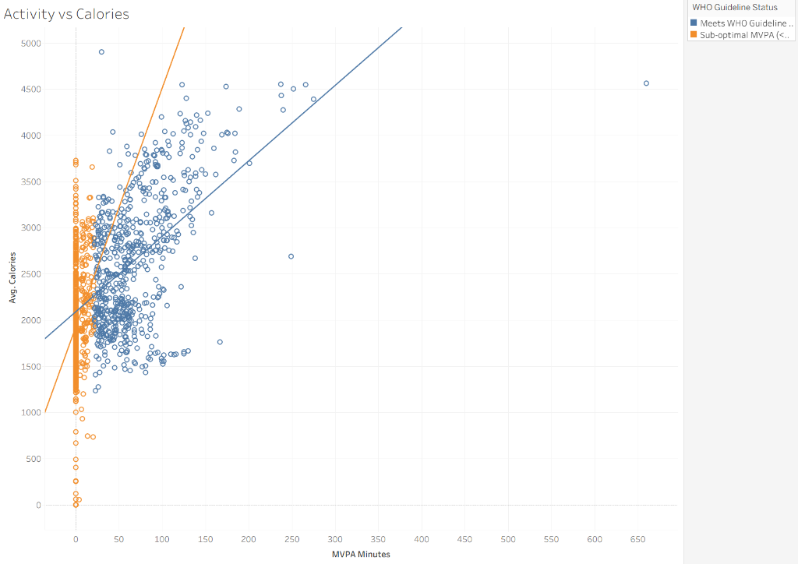
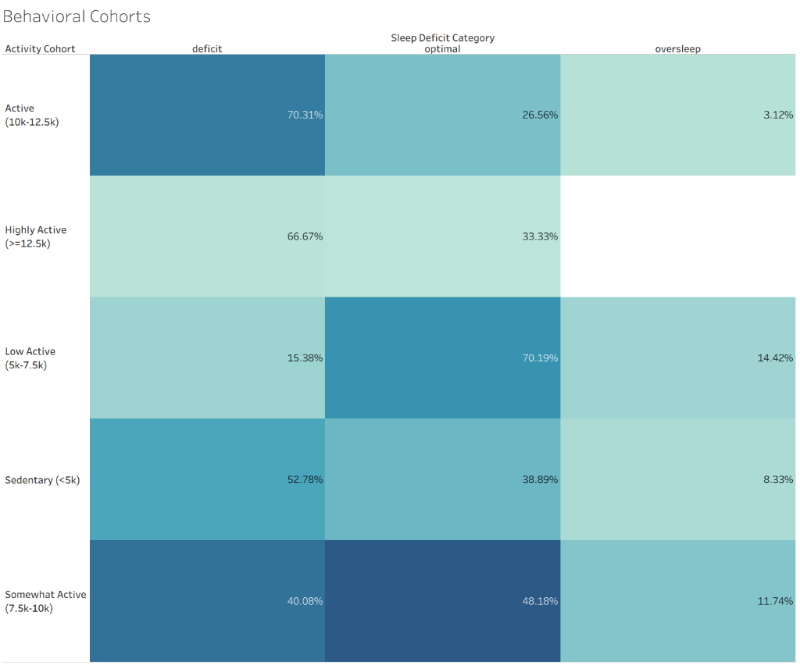
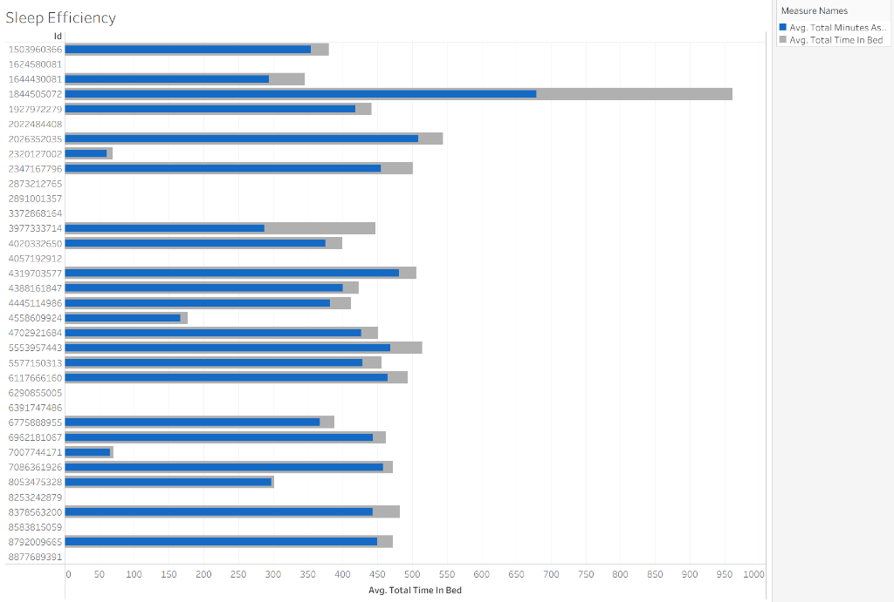

# Bellabeat Smart Device Analytics: Executive Insights Portfolio Project


---

## 1. Executive Summary

This project conducts a 2-month longitudinal study of 35 smart device users tracking physical activity, sleep, and weight. The final results reveal critical, counter-intuitive insights regarding user habit structures, including a significant **53.7-minute sleep reduction** on highly active days, which highlights a crucial lifestyle trade-off. We propose three actionable marketing and product recommendations to improve user wellness and drive premium subscriptions for Bellabeat's ecosystem.

---

## 2. Business Problem

Urška Sršen (Chief Creative Officer & Co-founder) believes that analyzing smart device tracker data can unlock new growth opportunities for Bellabeat's own line of products: the **Bellabeat App**, **Leaf tracker**, **Time smartwatch**, and **Spring smart water bottle**.

### Objectives:
* Analyze how non-Bellabeat consumers use their smart devices day-to-day.
* Apply Python, SQL, and statistical reasoning to clean, segment, and model user behaviors.
* Translate data-driven findings into marketing campaigns and product enhancements for Bellabeat.

---

## 3. Executive Dashboard

### Interactive Dashboard on Tableau Public
👉 **[Click Here to Explore the Live Interactive Dashboard](https://public.tableau.com/views/BellabeatSmartDeviceExecutiveAnalytics/Dashboard1?:language=en-GB&publish=yes&:display_count=n&:origin=viz_share_link)**

This dashboard provides executive-level business intelligence by combining users' activity and sleep habits. Designed for stakeholders to explore cohort trends, it displays real-time KPI metrics, active cycles, and correlation analysis.


---

## 4. Visualization Highlights

### Activity vs Calories
Our analysis reveals a clear positive correlation between Moderate-to-Vigorous Physical Activity (MVPA) and calories burned. Notably, the calorie burn rate scales differently depending on whether users meet or fail daily guidelines, demonstrating that consistency in reaching moderate thresholds accelerates metabolic outputs.

* **Business Takeaway:** Bellabeat should market its devices as active trackers that show real-time metabolic feedback, nudging users to cross the 21-minute daily active threshold to maximize health gains.

### Weekly Activity Pattern
The weekly cycle shows stable, relatively low step averages (6,600 to 7,700) throughout both weekdays and weekends. Concurrently, sedentary time remains consistently high, averaging over 1,000 minutes (16.6 hours) daily, highlighting a deeply rooted sedentary corporate lifestyle.

* **Business Takeaway:** Marketing should target daily active habits integrated into corporate office routines rather than focusing on weekend workouts, as users exhibit consistent movement patterns all week.

### Behavioral Cohorts
By analyzing the sleep-activity distribution grid (excluding non-wear sleep days), we see that users who walk 10,000+ steps experience a dramatic rise in sleep deficits (70.3% of their tracked sleep days). This confirms that highly active days frequently lead to time constraints, resulting in a lifestyle trade-off.

* **Business Takeaway:** The Bellabeat App must proactively protect users' sleep by offering wind-down routines and recovery coaching on highly active days.

### Sleep Efficiency
The Bar-in-Bar chart visually nests actual sleep time inside the total time spent in bed, highlighting sleep latency. While most users maintain a healthy sleep efficiency average of 91.4%, some show wide gray gaps, indicating they spend hours awake in bed struggling to fall asleep.

* **Business Takeaway:** Bellabeat can introduce custom sleep-hygiene content and smart bedtime reminders to help users reduce bed latency and improve overall rest quality.

---

## 5. Dashboard Features

* **Executive KPI Cards:** Consolidated indicators presenting total users, average steps, sleep, active minutes, and overall sleep efficiency.
* **Interactive Tableau Dashboard:** Multi-sheet layout synced using dashboard action filters for cohort drilldowns.
* **Behavioral Segmentation:** User classification based on Tudor-Locke steps indices and sleep deficit categories.
* **Weekly Activity Trends:** Dual-axis weekday line-and-bar analysis comparing steps vs. sedentary minutes.
* **Sleep Efficiency Analysis:** Bar-in-bar visualization comparing bed latency per user.
* **Activity vs. Calories Analysis:** Scatter plot showing daily burn rates with regression trend lines.
* **WHO Guideline Comparison:** Visual status indicator grouping users who meet the 150-minute weekly MVPA recommendation.
* **Executive Storytelling:** A structured dashboard design tailored to C-suite decision-making.

---

## 6. Key Findings

### Statistical Insights:
1. **The Sleep-Activity Tradeoff (Hypothesis Test):**
   * *Business Question:* Do highly active days improve sleep duration?
   * *Test:* Paired samples t-test comparing sleep duration on active vs. inactive days.
   * *Evidence:* On highly active days (MVPA >= 21 mins or steps >= 12,000), users sleep **53.7 minutes LESS** on average than on inactive days ($t = -3.32, p = 0.0038$, Cohen's $d = -0.76$, 95% CI: $[-87.7, -19.7]$ mins).
   * *Practical Impact:* Active days coincide with busy schedules where users sacrifice sleep. Bellabeat must actively protect users' sleep windows on high-activity days.
2. **Weekly Steps (Weekday vs. Weekend):**
   * *Business Question:* Do users walk more on weekends?
   * *Evidence:* Weekday average steps (7,142) vs. weekend average steps (6,936) showed no statistically significant difference ($t = -0.47, p = 0.6392$, Cohen's $d = -0.08$). Activity levels are consistently low throughout the entire week.
3. **Sedentary Dominance:**
   * Average sedentary time is **79% of the tracked day** (11.8 hours). Users are overwhelmingly desk-bound.

---

## 7. Business Recommendations

Every recommendation maps directly to Bellabeat's marketing and product development strategies:

1. **Product: Introduce the "Recovery Optimizer"**
   * *Observation:* Sleep duration drops by nearly an hour (53.7 mins) on highly active days.
   * *Evidence:* Paired t-test ($p = 0.0038$, Cohen's $d = -0.76$).
   * *Impact:* High active days without adequate sleep recovery lead to physical burnout and reduced compliance.
   * *Recommendation:* Implement a feature in the Bellabeat App. When the Leaf or Time tracker logs a highly active day, the app should trigger a wind-down notification 60 minutes early, offering a guided meditation or breathing session to protect the sleep window.
2. **Marketing: "Wellness Companions for the Working Woman"**
   * *Observation:* Users spend over 12 hours a day sedentary, mostly during business hours.
   * *Evidence:* Average sedentary ratio is 79%; 63% of tracked days exceed 12 hours of inactivity.
   * *Impact:* Prolonged sitting increases long-term health risks, leading to wellness dissatisfaction.
   * *Recommendation:* Launch a marketing campaign highlighting the Leaf's silent haptic alarms. Program the tracker to send a gentle vibration after 60 consecutive sedentary minutes, nudging the user to do a 3-minute "Desk Yoga" stretch from the Bellabeat library.
3. **Strategy: Cycle-Synced Goal Setting**
   * *Observation:* Standard trackers treat users identically. Bellabeat can leverage its female focus.
   * *Evidence:* Medical literature (CDC/WHO) shows that menstrual phases affect energy, recovery, and sleep.
   * *Impact:* General fitness targets are often unrealistic during certain phases of the cycle, frustrating users.
   * *Recommendation:* Enable cycle-synced goals in the Bellabeat App. Daily step targets and sleep reminders should adjust dynamically according to the user's menstrual phase (e.g., higher step goals in the follicular phase, active recovery prompts in the luteal phase).

---

## 8. Technical Skills Demonstrated

* **Data Cleaning & Engineering (Pandas, NumPy):** Custom aggregators, transition-day deduplication, datatype casting, and feature engineering.
* **Statistical Reasoning (SciPy):** Paired t-tests, Shapiro-Wilk normality tests, Wilcoxon tests, Cohen's d effect sizes, and K-Means clustering.
* **SQL Querying (SQLite):** View creation, rolling averages using window functions, CTEs, ranking, and cohort summaries.
* **Tableau Spec:** Strategic dashboard specification (calculated fields, sheets, filter actions).
* **Business Communication:** Executive summaries and findings reports using structured frameworks.

---

## 9. Methodology

Rather than analyzing only the standard 30-day Fitabase dataset (which is the typical course submission pattern), this project **consolidates both available Mechanical Turk datasets** to construct a seamless **61-day tracking window (March 12 - May 12, 2016)**.

### Transition Day Audit & Deduplication
Our data provenance audit uncovered a critical data quality issue on the transition date **April 12, 2016**, which appeared in both datasets. 
* Hourly logs showed that Month 1 was cut off at **10:00 AM** on April 12, resulting in artificially deflated step and calorie counts.
* Month 2 recorded the full **24-hour cycle**.
* **Consolidation Rule:** We discarded the Month 1 transition-day records and preserved Month 2's complete records, preventing data corruption and protecting our analysis from deflated averages.

### Sleep Data Reconstruction
Since Month 1 only contained minute-level sleep logs, we built a custom aggregator in `preprocessing.py` that maps sleep records to the **waking calendar date** (matching Fitabase's native behavior) and sums the minutes to construct a uniform sleep table.

---

## 10. Repository Structure

```
Bellabeat-Smart-Device-Analytics/
├── .gitignore
├── README.md
├── requirements.txt
├── data/
│   ├── raw/                 # Raw datasets (split by Month 1 & Month 2 folders)
│   └── processed/           # Cleaned, deduplicated, and feature-engineered outputs
├── images/
│   ├── activ_cal.png
│   ├── cohort.png
│   ├── dashboard_mockup.png
│   ├── sleep_efficent.png
│   └── weekly cycle.png
├── scripts/
│   ├── config.py            # Global constants, seeds, and directories
│   ├── utils.py             # Shared logging and string sanitization functions
│   ├── preprocessing.py     # Aggregates sleep, applies transition-day deduplication
│   ├── feature_engineering.py # Computes sleep efficiency, active percentages, consistency
│   ├── analysis.py          # Runs paired t-tests, ANOVA, and KMeans clustering
│   └── db_setup.py          # Populates SQLite database with cleaned files
├── sql/
│   ├── schema.sql           # Reusable DDL schemas
│   ├── views.sql            # Table joins and segmentation views
│   └── business_queries.sql # ~20 business queries (CTEs, windows, rolling averages)
├── notebooks/
│   ├── 01_data_preparation.ipynb
│   ├── 02_exploratory_analysis.ipynb
│   ├── 03_feature_engineering.ipynb
│   ├── 04_statistical_analysis.ipynb
│   └── 05_tableau_export.ipynb
├── tableau/
│   └── dashboard_spec.md    # Tableau calculated fields and visual spec
└── reports/
    ├── data_provenance.md   # Data audit report (Month 1/2 transition cut-off finding)
    ├── data_quality_summary.md # Post-cleaning metrics
    ├── statistical_and_segmentation_analysis.md # Statistical outputs
    └── executive_summary.md # Executive business brief
```

---

## 11. Setup Instructions

Follow these numbered steps to reproduce the entire analytics pipeline locally:

1. **Clone the Repository:**
   ```bash
   git clone https://github.com/Shanksreddy005/Bellabeat-Smart-Device-Analytics-Platform.git
   cd Bellabeat-Smart-Device-Analytics-Platform
   ```
2. **Install Dependencies:**
   ```bash
   pip install -r requirements.txt
   ```
3. **Verify the Dataset Placement:**
   Ensure the raw Fitbit files are placed in the `data/raw/month1/` and `data/raw/month2/` folders respectively, as mapped out in `scripts/config.py`.
4. **Execute Preprocessing:**
   ```bash
   python scripts/preprocessing.py
   ```
   This will align datatypes, aggregate Month 1 sleep records, execute transition-day deduplication, and export clean files to `data/processed/`.
5. **Run Feature Engineering:**
   ```bash
   python scripts/feature_engineering.py
   ```
   This generates active ratios, sleep efficiency, user consistencies, and behavioral classifications.
6. **Initialize the SQLite Database:**
   ```bash
   python scripts/db_setup.py
   ```
   This will initialize `data/processed/bellabeat.db`, execute `sql/schema.sql` and `sql/views.sql`, and populate the tables with processed data.
7. **Execute Notebooks:**
   Open Jupyter Notebook or Lab and run the notebooks in `notebooks/` sequentially to interactively inspect results.
8. **Open Tableau Workbook:**
   Connect Tableau Desktop to the generated SQLite database `bellabeat.db` or the processed CSV exports, using the specs in `tableau/dashboard_spec.md` to map calculations and filter actions.

---

## 12. Limitations

* **Historical Dataset:** The Fitbit dataset was collected in 2016. While standard for training analyses, consumer behavior, screen time habits, and wearable technology accuracy have evolved.
* **Small Participant Pool:** The study tracks 35 users, which decreases to 24 users for sleep analysis and only 8-11 users for weight logging. This small sample size restricts generalized demographic representation.
* **No Demographic Attributes:** The dataset lacks gender, age, occupation, and geographical location indicators. Because Bellabeat products are specifically designed for women, demographic alignments are based on medical literature rather than direct evidence.
* **Wearable Hardware Limitations:** Smart device tracker logs are subject to user errors, non-wear times, and battery drains which can introduce noise.
* **Association vs. Causation:** The findings show statistical associations (e.g., lower sleep duration on active days) but cannot verify direct physical or psychological causation.
* **Direct Inference Constraints:** Fitbit consumer habits serve as a proxy and cannot directly infer how current Bellabeat customers interact with Bellabeat-specific hardware.

---

## 13. Future Improvements

* **Predictive Modeling:** Build machine learning classifiers (e.g., Random Forests or XGBoost) to predict days when a user is likely to experience a sleep deficit based on mid-day activity.
* **Anomaly Detection:** Implement automated alerts for sudden declines in sleep efficiency or device wear time, signaling potential illness or abandonment.
* **Automated ETL Scheduling:** Design an Apache Airflow or Prefect pipeline to automate daily data ingestion, cleaning, and model updates.
* **Interactive Streamlit Deployment:** Build an interactive Python dashboard using Streamlit to serve as a web-based presentation of the metrics.
* **Cloud Database Migration:** Migrate the local SQLite instance to a cloud data warehouse (e.g., Snowflake or Google BigQuery) to simulate enterprise analytical workloads.
* **Additional Wearable Integrations:** Expand the ingestion scripts to process Apple Health, Garmin, and Oura Ring datasets.
* **Longitudinal Cohort Study:** Analyze multi-year tracker logs to model seasonality and long-term user retention.
